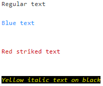

* [printd](#printd)
    * [formString](#formString)
* [info, warning, fault](#info-messages)
* [warning](#warning_info)
* [skipped](#skipped)
* [abort](#abort)

<br/>

<a id="printd"></a>
### **void prind(Map style, Object message)**
It works like default print() but with text decoration ability. Recieves convertible to string object as message.


Available style properties:
| Property | Value                                                 |
|----------|-------------------------------------------------------|
| ts       | bold, italic, underline, strike                       |
| fg       | black, red, green, yellow, blue, magenta, cyan, white |
| bg       | black, red, green, yellow, blue, magenta, cyan, white |


Example:
```groovy
printd('Regular text')
printd('Blue text', fg: 'blue')
printd('Red striked text', fg: 'red', ts: 'striked')
printd('Yellow italic text on black', fg: 'yellow', bg: 'black', ts: 'italic')
```
Output:  


<a id="formString"></a>
You can also form decorated string to use it in other functions by calling **printd.Formstring** with arguments equal to **printd** function.

Example:
```groovy
def text = printd.formString('This is my decorated text', fg: 'blue', ts: 'bold')
ansiColor {
    println(text)
}
```

---

<a id="info-messages"></a>
### **void info(Object message)**
### **void warning(Object message)**
### **void fault(Object message)**
Colorizes text with the help of [printd](#printd) and adds emojis.


Example:
```groovy
info('Info message')
warning('Warning message')
fault('Fault message')
```
Output:  


---

<a id="skipped"></a>
### **void skipped(Object message)**
Marks current stage as skipped and prints warning message. Can receive convertible to string object for custom console output.


Example:
```groovy
stage('Test') {
    if(true) {
        skipped()
    }
    else {
        // do something
    }
}
```
Output:  
> WARNING: stage Test marked as skipped  

If you want DSL-like implementation for skipping stages in scripted pipeline check [this](https://github.com/comquent/imperative-when) library.

---

<a id="abort"></a>
### **void abort(Object message)**
Aborts build and current stage, prints warning message. Can receive convertible to string object for custom console output.  
Uses timeout DSL function to abort the build so messages about timeout will be printed as well.


Example:
```groovy
stage('Test') {
    abort()
    print('This message will not be printed')
}
```
Output:
>WARNING: abort was called for stage Test  
Timeout expired 0 ms ago  
Cancelling nested steps due to timeout  
Timeout has been exceeded  
Finished: ABORTED